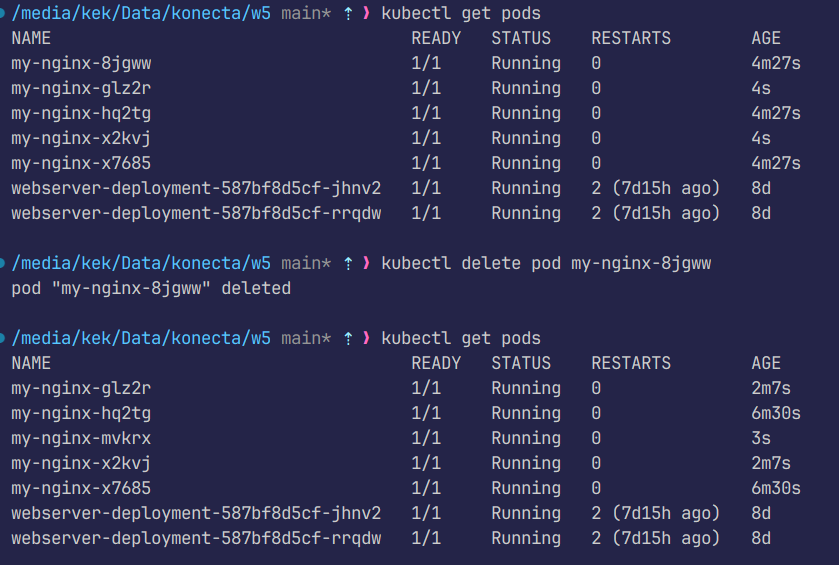
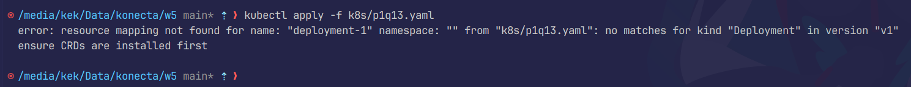
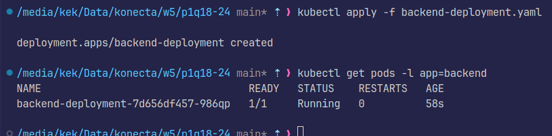

# Konecta Week 5 (Kubernetes)

## Part 1

### Q1
```bash
kubectl run my-nginx --image=nginx --restart=Never
```
This creates a pod named my-nginx from nginx image, restart=never makes sure that it is a single pod instead of kubectl run defaulting to a deployment


### Q2
```bash
kubectl run my-nginx --image=nginx123 --restart=Never
```
This should create a pod named my-nginx from nginx123 container image


### Q3
The status "AlreadyExists: pods "my-nginx" already exists" means that there is already a pod with the same name so I must choose a different name for the pod

### Q4
```bash
kubectl describe pod my-nginx
```
This command lists all the detailed information about a specific pod like its name, IP, container image used, etc... using its name


### Q5
```bash
kubectl delete pod my-nginx
```
This command deletes the pod named my-nginx


### Q6
```bash
kubectl apply -f k8s/p1q6.yaml
```
This command applies the yaml file with a pod named my-nginx, along with some test labels


### Q7
```bash
kubectl apply -f k8s/p1q7.yaml
```
This command applies the yaml file with a replicaset named my-nginx, then specified the number of replicas to 3 using the nginx image


### Q8
```bash
kubectl scale --replicas=5 rs/my-nginx 
```
This command scales the amount of replicas in the replicaset to 5, which automatically creates 2 more pods to accommodate for the new desired state


### Q9
```bash
kubectl delete pod my-nginx-8jgww
```
This command deletes one of the pods made by the replicaset. However, immediately after deleting it, the replicaset provisions a new pod to deploy


### Q10
```bash
kubectl edit rs my-nginx
```
This command allows me to modify the number of replicas from the cli without using the scale command, it opens vi for me to edit the spec.replicas to 2, then save the changes


### Q11
This Yaml provided has an error, where it uses the label "tier" to match the replicas but it did not specify this label in the template above, even attempting to apply this yaml proves my claim


### Q12
After careful inspection of the faulty provided yaml file, the error I found was that "deployment" was used instead of "Deployment" which does not match the known scheme


### Q13
After inspecting the faulty provided yaml file, the error I found was that the apiVersion was "v1" instead of "apps/v1" which does not match the known scheme


### Q14
```bash
kubectl get deployments -o wide
```
You get use the command above to get detailed information about all deployments, including used container image, or you could use ``` kubectl describe deployment <deployment-name> ```


### Q15
```bash
kubectl apply -f k8s/p1q15.yaml
```
Applying this yaml file creates the deployment with the specified parameters


### Q16
```bash
kubectl set image deployment/httpd-frontend httpd=nginx777
```
This command changes the image in the specified deployment. However since this new image does not exist, the deployment is stuck in an imagepullbackoff and the number of current pods is 4, 1 is up to date and in error state, and the rest are on the old version but functioning


### Q17
```bash
kubectl rollout undo deployment/httpd-frontend
```
This command allows me to undo to the previous version, in case the current version is faulty 


### Q18 to Q23 are in the ```/p1q18-23``` directory since they are related
#### Q18
```bash
docker build -t gimmeursocks/simple-webapp:v1 .
docker login
docker push gimmeursocks/simple-webapp:v1
```
These commands use the dockerfile to build, authenticate, then push the image to docker hub using my credentials


#### Q19
```bash
kubectl apply -f frontend-deployment.yaml
```
This command applies my frontend deployment that uses the image I previously pushed to docker hub


#### Q20
```bash
kubectl apply -f frontend-service.yaml
```
This command applies my nodeport service that exposes the frontend, and since im using minikube, I have to retrieve its IP first then check the port


#### Q21
```bash
kubectl apply -f backend-deployment.yaml
```
This command applies my backend deployment that uses a python slim image with a list of commands to start the http server at port 8080, now I must expose it internally


#### Q22
```bash
kubectl apply -f backend-service.yaml
```
This command applies my backend service, since this service does not need external access, then clusterIP is sufficient, then testing using port forwarding tells me that it is working


#### Q23
```bash
kubectl apply -f frontend-lb-service.yaml
```
This command applies my frontend service of type loadbalancer, since I am using minikube, there is no external IP, so just like the nodeport above, I should use minikube IP + assigned port to access the simulated loadbalancer


### Q24
```bash
kubectl apply -f k8s/p1q24.yaml 
```
This command applies my daemonset, which ensures that one pod runs on every node, it is usually used for logging agents and monitoring agents like Prometheus node exporter


### Q25
#### Components of the master node are:
- API Server: The entry point which exposes k8s api using REST
- etcd: Key-value store of cluster config and state
- Controller Manager: Ensures desired state matches the actual state of deployments, endpoints, etc..
- Scheduler: Assigns pods to nodes based on resources
- Cloud Controller Manager (optional): Integration with cloud providers on loadbalancers, volumes, etc..

### Q26
#### Components of the worker node are:
- kubelet: Agent running on each node, ensures that the pods are actually running
- kube-proxy: Manages networking and load balancing for services
- Container Runtime: The engine that actually runs the containers (Containerd)
- Node OS: Linux/Windows providing system resources